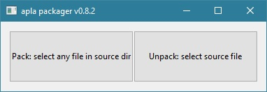

# Applications Packager

Simvolio and Protypo files packager for import into the Ecosystems created in the AplaProject/GenesisKernel blockchain.
Utilite that can convert import json bundle from/to files of simvolio, protypo, csv, json.

### struct.dot

Is created in the process of packing or unpacking. Shows the structure of an application. Can be opened using [graphviz](http://graphviz.org/download/) or [webgraphviz](http://webgraphviz.com/)

 

## Examples

### Unpack file from "basic.sim" to "basic/"

>ap basic.sim

### Pack files from "basic/" to basic.json

>ap basic/

Without arguments starts the GUI

 

## build

Windows tip. If you do not plan to work in the console, add "-ldflags -H=windowsgui" 

>go build

### on linux for windows

 >env GOARCH=amd64 GOOS=windows CGO_ENABLED=1 CC=/usr/bin/x86_64-w64-mingw32-gcc CXX=/usr/bin/x86_64-w64-mingw32-g++  go build

